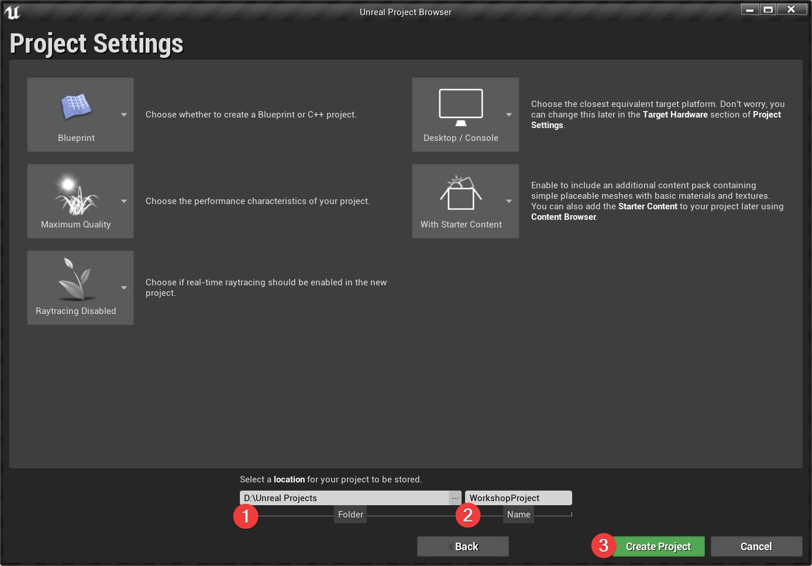

# Session 1

---

### Creating a new project
  - [ ]   Launch the "Epic Games Launcher".
  - [ ]   Navigate to Unreal Engine->Library
  - [ ]   Click on launch on version 4.26.1
  

  
click to expand 

  
  
  

###

    The Epic Games Launcher is the main software hub from Epic. It also contains  
    their game store (which you can disable if you want to by going to Settings
    and selecting Hide Game Library)

    After a few seconds the editor should start and you will be presented with
    the Unreal Project Browser.

  - [ ]   Select Games. Click Next.
  - [ ]   Select First Person. Click Next".
  - [ ]   Leave settings to default and set a project location and name. Click Create Project.

  

  
click to expand 

  
  
  
  
  

###

    The Unreal Project Browser allows you to open an existing project or create
    a new one.
    The two main aspects to consider are:
      - the template project to start from
      - blueprint or C++ project

    While you don't need to start from a template project, as you can rebuild
    everything yourself, it's not recommended as the template projects are
    often good starting points (at least for learning purposes).

    Selecting C++ will generate a .sln file that needs to be opened with Visual
    Studio. C++ falls outside the scope of this workshop. We will be sticking
    with Blueprints because they are:
      - easier to understand
      - sufficient for building a complete game (that doesn't heavily deviate
      from the standard systems already implemented in unreal)

  [Where C++ is pretty much mandatory](https://forums.unrealengine.com/community/general-discussion/121087-blueprints-vs-c-programming-which-one-to-use?148076-Blueprints-Vs-C-Programming-Which-one-to-use=&viewfull=1#post1013378)
