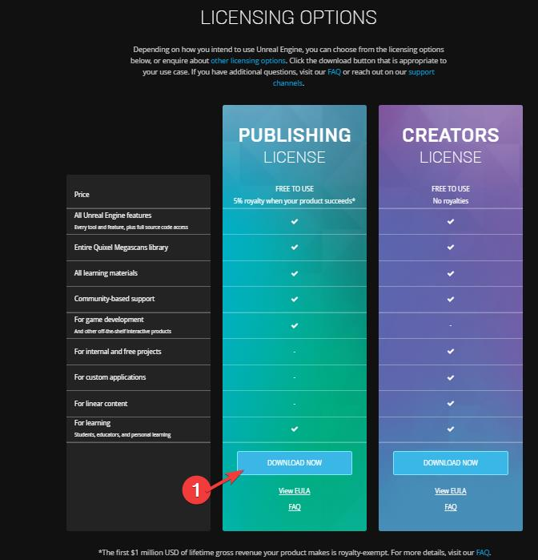

# Session 0
[Back to workshop](https://github.com/Bleeck/UE_Workshop)

---

* [Installing Unreal](https://github.com/Bleeck/UE_Workshop/blob/master/Session_0.md#installing-unreal)
---
### [Installing Unreal](https://github.com/Bleeck/UE_Workshop/blob/master/Session_0.md)
 1: Navigate to the [unreal page](https://www.unrealengine.com/)

###

  

  
2: Click on **Download** 

  
  
   

###

  

  
3: Click **Download Now** on the Publishing License variant 

  
  
   

###

    For our purposes it really doesn't matter which license you choose.
    The EULA allows the user to accept both licenses.

###

4: Run the installer 

   

###

5:  Choose an install location and after that click on **Install**

###

6: Wait for any updates to download 

   

###

7: You will be presented with a Login Screen. If you don't have an Epic Games account, sign up for one. 

###

    The Epic Games Launcher is the main software hub from Epic. It also contains  
    their game store (which you can disable, if you want to, by going to Settings
    and selecting Hide Game Library)

###

8: Navigate to the Engine Versions and click on  **+**  to install a new version of the Unreal Engine. 

###

9: This will add an Version in the Engine Versions list. Click on **Install**. 

###

10: The "Folder" parameter is the path where all future versions of the engine will be installed to. The "Path" parameter is where the current version of the engine will be installed to.

11: Click on **Options**

  - 12: Make sure that only selected options are:
      * Core Components
      * Starter Content
      * Templates and Feature Packs

      Uncheck everything else, as those options deal with:
      * generating a c++ project
      * releasing the game to various platforms (ios/android/linux/etc)
      

      
click on expand. 

      
      

###      

  13: Click on **Apply** and after that click on **Install**

###

14: Wait for the download / install to finish. 

###

###

    Notes: you can install the optional components if you want,
    but we won't need them in this workshop.

    If you get an error "DP-06", try:
      * updating the Launcher
      * restarting the Launcher
      * running the Launcher as Admin
      * disabling off the VPN
