# Session 1
[Back to workshop](https://github.com/Bleeck/UE_Workshop)

---

* [Creating a new project](https://github.com/Bleeck/UE_Workshop/blob/main/Session_1.md#creating-a-new-project)
* [Editor Basics](https://github.com/Bleeck/UE_Workshop/blob/main/Session_1.md#editor-basics)
* [Play In Editor](https://github.com/Bleeck/UE_Workshop/blob/main/Session_1.md#play-in-editor)
* [Editor Settings](https://github.com/Bleeck/UE_Workshop/blob/main/Session_1.md#editor-settings)
---

### [Creating a new project](https://github.com/Bleeck/UE_Workshop/blob/main/Session_1.md)
  - 1.  Launch the "Epic Games Launcher".
  - 2.  Navigate to Unreal Engine->Library
  - 3.  Click on launch on version 4.26.1
  

  
click to expand 

  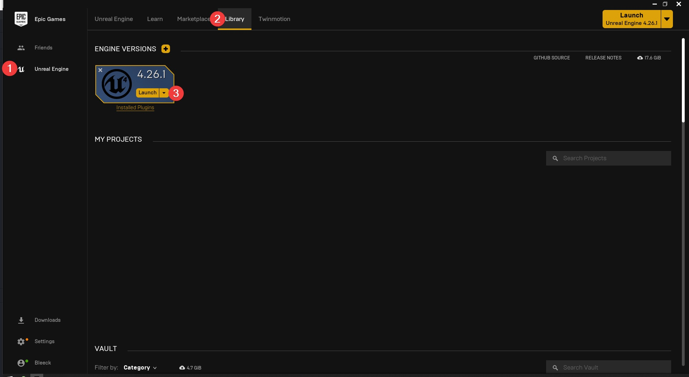
  
  

###

    The Epic Games Launcher is the main software hub from Epic. It also contains  
    their game store (which you can disable if you want to by going to Settings
    and selecting Hide Game Library)

    After a few seconds the editor should start and you will be presented with
    the Unreal Project Browser.

  - 4.   Select Games. Click Next.
  - 5.   Select First Person. Click Next".
  - 6.   Leave settings to default and set a project location and name. Click Create Project.

  

  
click to expand 

  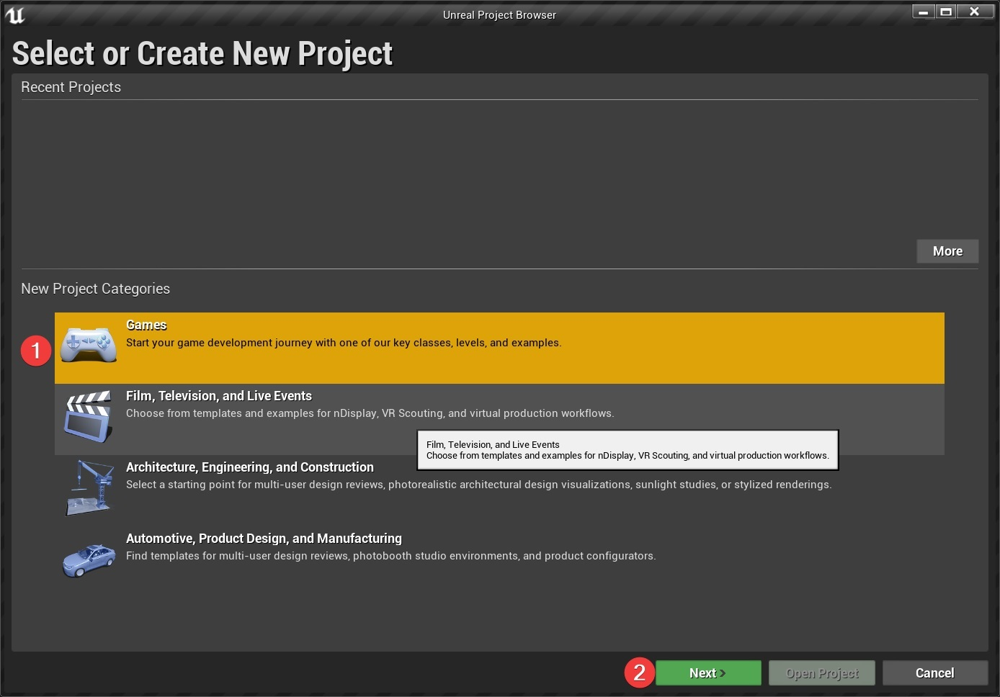
  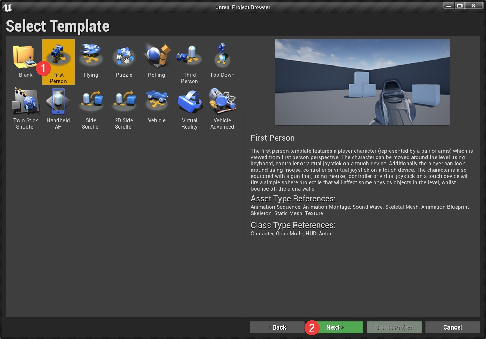
  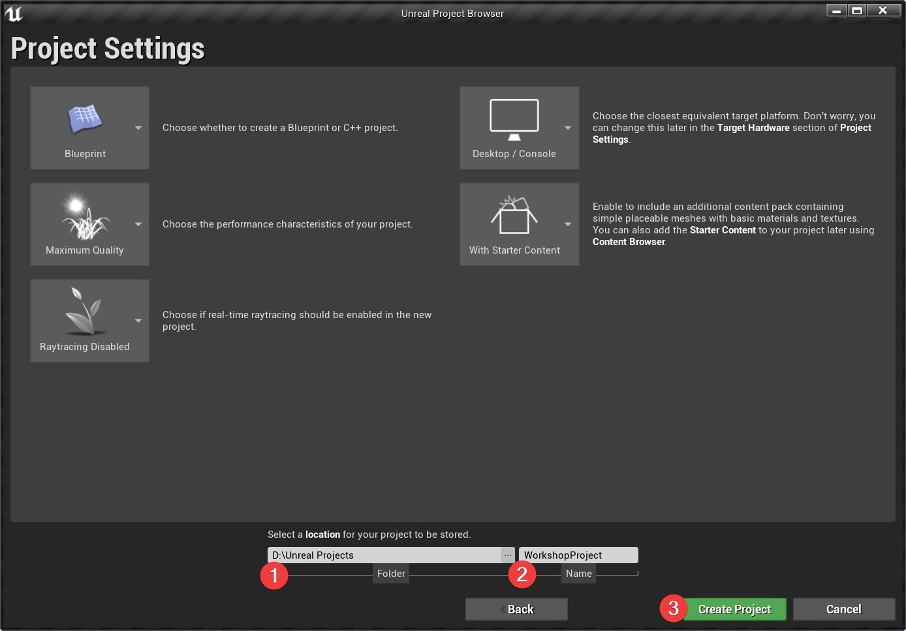
  
  

###

    The Unreal Project Browser allows you to open an existing project or create
    a new one.
    The two main aspects to consider are:
      - the template project to start from
      - blueprint or C++ project

    While you don't need to start from a template project, as you can rebuild
    everything yourself, it's not recommended as the template projects are
    often good starting points (at least for learning purposes).

    Selecting C++ will generate a .sln file that needs to be opened with Visual
    Studio. C++ falls outside the scope of this workshop. We will be sticking
    with Blueprints because they are:
      - easier to understand
      - sufficient for building a complete game (that doesn't heavily deviate
      from the standard systems already implemented in unreal)

  [Where C++ is more or less mandatory](https://forums.unrealengine.com/community/general-discussion/121087-blueprints-vs-c-programming-which-one-to-use?148076-Blueprints-Vs-C-Programming-Which-one-to-use=&viewfull=1#post1013378)

---

### [Editor Basics](https://github.com/Bleeck/UE_Workshop/blob/main/Session_1.md)

click to expand 

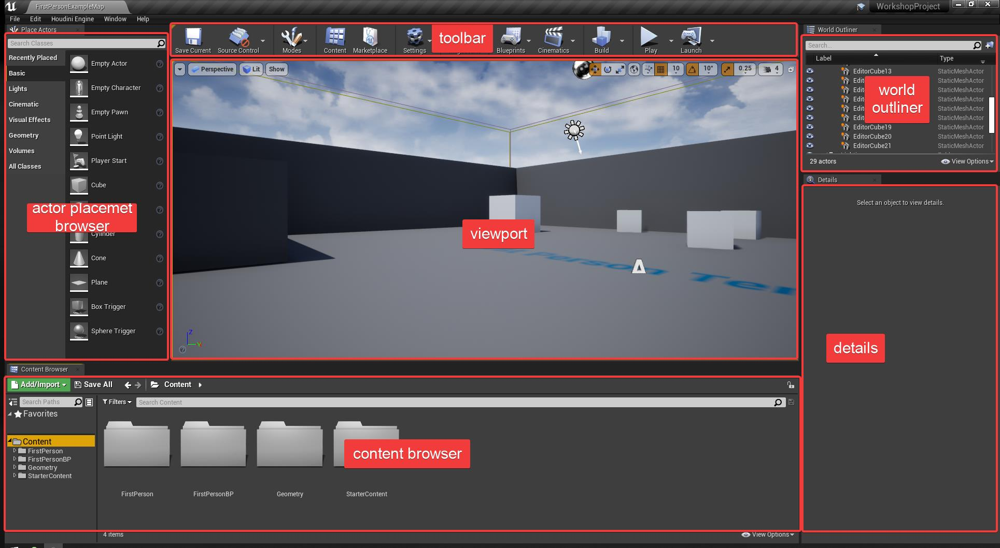

   

    * Actor placement browser : this usually doesn't get used that much. Mostly
    used to place lights and volumes
    * ToolBar : Quick access to commonly used commands and menus
    * Content Browser : the asset library of the project
    * World Outliner : lists all of the actors placed in a level
    * Details : shows the properties of the selected level object

---

### [Play In Editor](https://github.com/Bleeck/UE_Workshop/blob/main/Session_1.md)

click to expand 

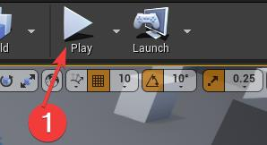
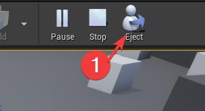

   

    PIE. By clicking on the play button (or pressing alt + P) the
    editor enters Play in Editor mode. In this mode, the game is running in the
    viewport. To exit PIE press the escape key.

    When PIE starts, LMB clicking in the viewport will lock the mouse cursor to
    that viewport. To release the cursor either press Escape to stop PIE or press
    Shift + F1 to regain control. After regaining control, if you click back
    in the viewport, you will again lose control. In order to select and
    manipulate objects during PIE, click on the Eject Button (or press F8).

WARNING: All changes done in the level during play in     editor are LOST when exiting PIE.

---

### [Editor Settings](https://github.com/Bleeck/UE_Workshop/blob/main/Session_1.md)
  

  
 Open Editor Preferences 

  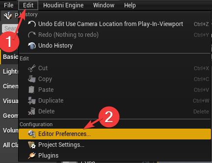
  

  

  
 Type in "Search Details" textbox to filter settings 

  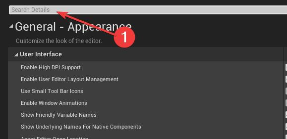
  

  

  
 Disable Autosave 

  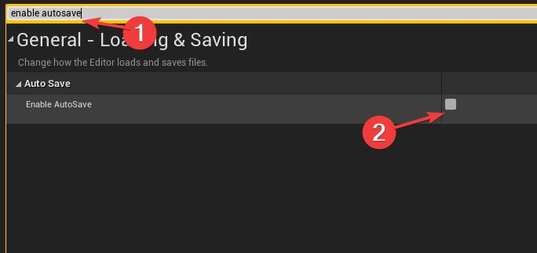
  

      I personally never rely on autosave.

  

  
 Disable Game Sound 

  
  

      If you don't need game sounds, it's easier to just disable them in the
      editor.

  

  
 Disable Use Camera Location From Play In Viewport 

  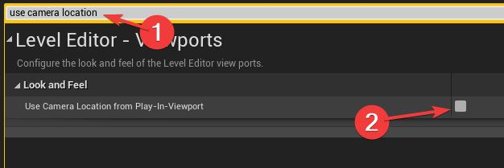
  

    This setting will cause the viewport camera to return to where it was before
    the PIE session started. Useful if you're editing a mission and don't want
    to have to keep navigating to the mission start location.

  

  
 Enable Blueprint Save On Successful Compile 

  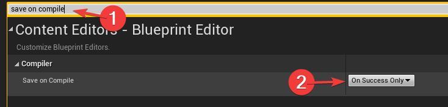
  

      This setting will cause the editor to automatically save your blueprint
      when it successfully compiles. I've found that it is extremely rare that
      you don't also click the save button after compiling (usually it's because
      you forget to save)
  
  

#### Mouse Cursor Icon :
     The default mouse cursor behavior makes the cursor difficult to see. The
     editor uses the windows "Precision" cursor while the mouse is over the
     viewport. In order to change it perform the following steps:

  

  
Search and open "mouse settings" in start menu 

  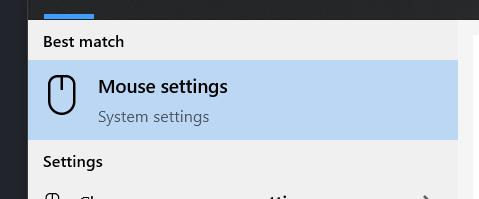
  
   

  

  
Click on "Additional Mouse Options" 

  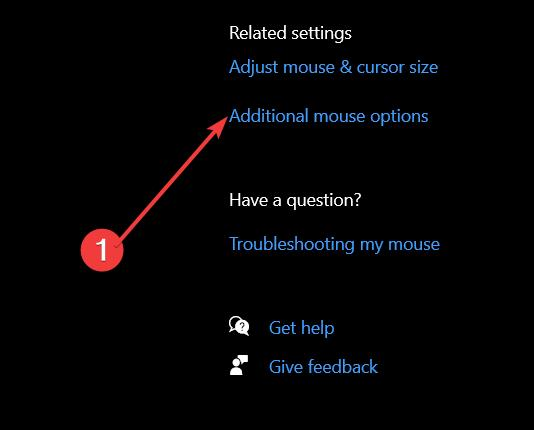
  
   

  

  
Go to "Pointers" -> select "Precision Cursor" -> Click on browser 

  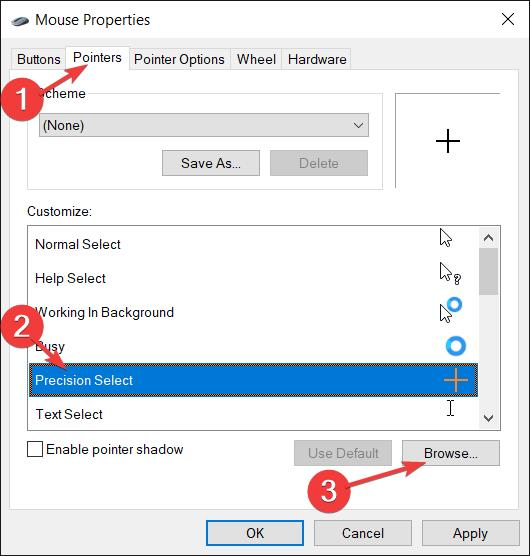
  
   

  

  
Navigate to "C:/Windows/Cursors" and select "aero_arrow.cur". Click on "Open" 

  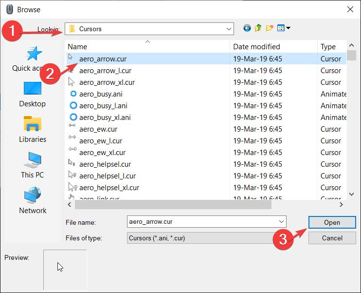
  
   

  

  
Click OK to close the window

  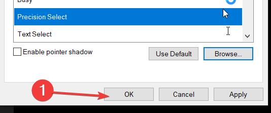
  
   
