# Session 1
[Back to workshop](https://github.com/Bleeck/UE_Workshop)

---

* [Creating a new project](https://github.com/Bleeck/UE_Workshop/blob/main/Session_1.md#creating-a-new-project)
* [Editor Basics](https://github.com/Bleeck/UE_Workshop/blob/main/Session_1.md#editor-basics)
* [Play In Editor](https://github.com/Bleeck/UE_Workshop/blob/main/Session_1.md#play-in-editor)
* [Editor Settings](https://github.com/Bleeck/UE_Workshop/blob/main/Session_1.md#editor-settings)
* [Blueprint Basics](https://github.com/Bleeck/UE_Workshop/blob/master/Session_1.md#blueprint-basics)
* [Printing to the screen and Detecting inputs](https://github.com/Bleeck/UE_Workshop/blob/master/Session_1.md#printing-to-the-screen-and-detecting-inputs)
* [Variables](https://github.com/Bleeck/UE_Workshop/blob/master/Session_1.md#variables)
* [Debug draw](https://github.com/Bleeck/UE_Workshop/blob/master/Session_1.md#debug-draw)
* [Flow Control](https://github.com/Bleeck/UE_Workshop/blob/master/Session_1.md#flow-control)
* [Functions](https://github.com/Bleeck/UE_Workshop/blob/master/Session_1.md#functions)
---

### [Creating a new project](https://github.com/Bleeck/UE_Workshop/blob/main/Session_1.md)
  - 1:  Launch the "Epic Games Launcher".
  - 2:  Navigate to Unreal Engine->Library
  - 3:  Click on launch on version 4.26.1 (or whatever 4.26.X version you have installed)
  

  
click to expand 

  
  
  

###

    After a few seconds the editor should start and you will be presented with
    the Unreal Project Browser.

    Note: You might be asked to install additional features. Allow
    the editor to install what it needs (like dotnet 3.5 etc).

  - 4:   Select Games. Click Next.
  - 5:   Select First Person. Click Next".
  - 6:   Leave settings to default and set a project location and name. Click Create Project.

  

  
click to expand 

  
  
  
  
  

###

    The Unreal Project Browser allows you to open an existing project or create
    a new one.
    When creating a new project there are two main aspects to consider:
      - the template project to start from
      - blueprint or C++ project

    While you don't need to start from a template project, as you can rebuild
    everything yourself, it's not recommended as the template projects are
    often good starting points (at least for learning purposes).

    Selecting C++ will generate a .sln file that needs to be opened with Visual
    Studio. C++ falls outside the scope of this workshop. We will be sticking
    with Blueprints because they are:
      - easier to understand
      - sufficient for building a complete game (that doesn't heavily deviate
      from the standard systems already implemented in unreal)

  [Where C++ is more or less mandatory](https://forums.unrealengine.com/community/general-discussion/121087-blueprints-vs-c-programming-which-one-to-use?148076-Blueprints-Vs-C-Programming-Which-one-to-use=&viewfull=1#post1013378)

---

### [Editor Basics](https://github.com/Bleeck/UE_Workshop/blob/main/Session_1.md)

click to expand 

   

    * Actor placement browser : this usually doesn't get used that much. Mostly
    used to place lights and volumes
    * ToolBar : Quick access to commonly used commands and menus
    * Content Browser : the asset library of the project
    * World Outliner : lists all of the actors placed in a level
    * Details : shows the properties of the selected level object

---

### [Play In Editor](https://github.com/Bleeck/UE_Workshop/blob/main/Session_1.md)

click to expand 

   

    PIE. By clicking on the play button (or pressing alt + P) the
    editor enters Play in Editor mode. In this mode, the game is running in the
    viewport. To exit PIE press the escape key.

    When PIE starts, LMB clicking in the viewport will lock the mouse cursor to
    that viewport. To release the cursor either press Escape to stop PIE or press
    Shift + F1 to regain control. After regaining control, if you click back
    in the viewport, you will again lose control. In order to select and
    manipulate objects during PIE, click on the Eject Button (or press F8).

WARNING: All changes done in the level during play in     editor are LOST when exiting PIE.

---

### [Editor Settings](https://github.com/Bleeck/UE_Workshop/blob/main/Session_1.md)
  

  
 Open Editor Preferences 

  
  

  

  
 Type in "Search Details" textbox to filter settings 

  
  

  

  
 Disable Autosave 

  
  

      I personally never rely on autosave.

  

  
 Disable Game Sound 

  
  

      If you don't need game sounds, it's easier to just disable them in the
      editor.

  

  
 Disable Use Camera Location From Play In Viewport 

  
  

    This setting will cause the viewport camera to return to where it was before
    the PIE session started. Useful if you're editing a mission and don't want
    to have to keep navigating to the mission start location.

  

  
 Enable Blueprint Save On Successful Compile 

  
  

      This setting will cause the editor to automatically save your blueprint
      when it successfully compiles. I've found that it is extremely rare that
      you don't also click the save button after compiling (and it's usually because
      you forget to save)
  
  

#### Mouse Cursor Icon :
     The default mouse cursor behavior makes the cursor difficult to see in the
     editor viewport. The editor uses the windows "Precision" cursor while the mouse
     is over the viewport. In order to change it perform the following steps:

  

  
 1: Search and open "mouse settings" in start menu 

  
  
   

  

  
 2: Click on "Additional Mouse Options" 

  
  
   

  

  
 3: Go to "Pointers" -> select "Precision Cursor" -> Click on browser 

  
  
   

  

  
 4: Navigate to "C:/Windows/Cursors" and select "aero_arrow.cur". Click on "Open" 

  
  
   

  

  
 5: Click OK to close the window

  
  
   

---

### [Blueprint Basics](https://github.com/Bleeck/UE_Workshop/blob/main/Session_1.md)

    Create a folder by RMB click in the content browser and selecting
    "New Folder". Name it "Work".

  

  
click to expand 

  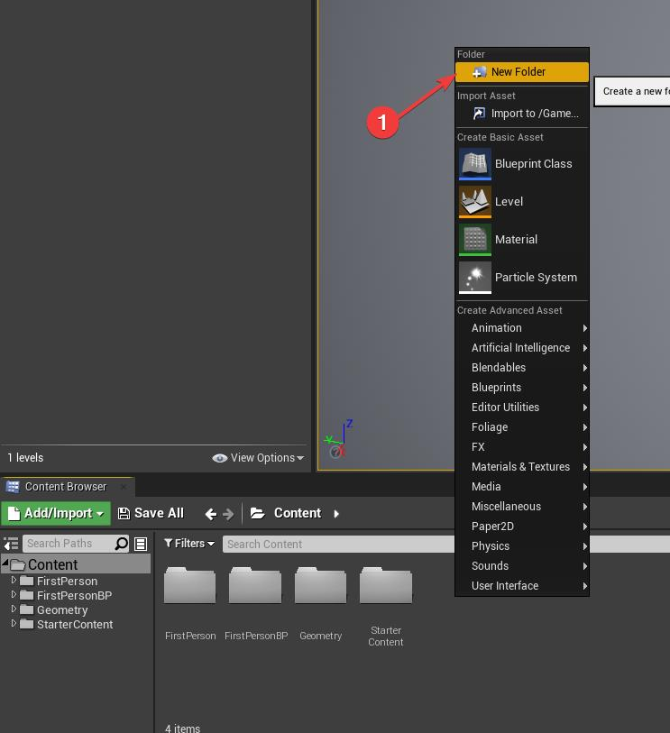
  
   

###

    Inside that folder, let's create our first blueprint. Right click in the content browser
    and select Blueprints-> Blueprint Class.

  

  
click to expand 

  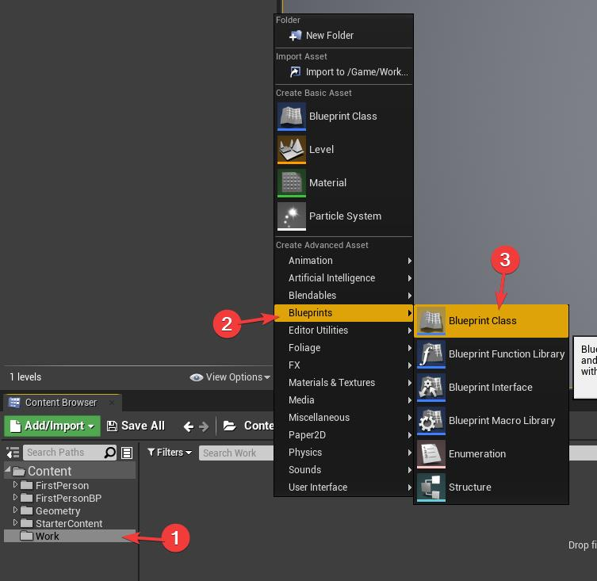
  
   

###

    Select Actor as the parent class. Name the blueprint "MyActor"

  

  
click to expand 

  
  
   

###

    Note: An asterisk next to an asset in the content browser means that
    the asset has unsaved modifications. You can save by RMB clicking on the asset
    and selecting "Save", selecting the asset and pressing CTRL+S or by
    pressing "CTRL + SHIFT + S" which saves everything.

  

  
click to expand 

  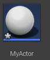
  
   

###

    Double click on the actor to open the blueprint editor.

    The Blueprint Editor contains the following elements:
      - components panel: this is where you can add or remove components on your actor
      - my blueprint: this is where you declare your functions, variables, events etc
      - toolbar: this is were you can find the main debugging controls
      - Details panel

  

  
click to expand 

  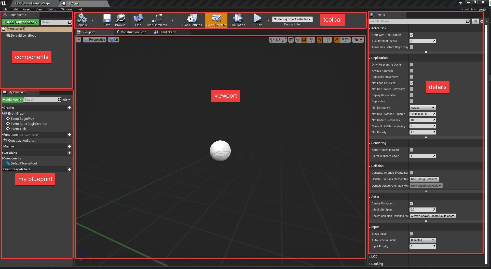
  
   

###

    The Blueprint Editor also has 2 extra panels that are hidden behind the viewport
    panel. Those are:
    - the construction script : useful for level design automation
    - the event graph : the place where you actually do your blueprint
    scripting

  

  
click to expand 

  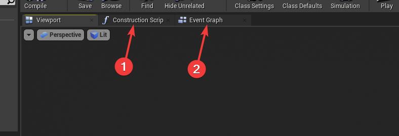
  
   

###
---

### [Printing to the screen and Detecting inputs](https://github.com/Bleeck/UE_Workshop/blob/main/Session_1.md)
    To directly get an input (the quick, dirty and incorrect way), we can add a Keyboard Event
    node in the event graph.

    Right click and type "Keyboard Events X" and press enter.

###

  

  
click to expand 

  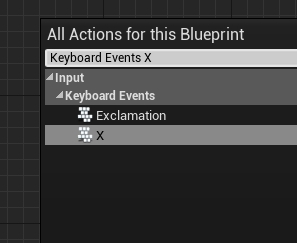
  
   

###

    To print something to the screen we need to add a
    "Print String" node.

###

  

  
click to expand 

  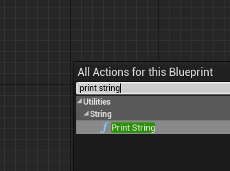
  
   

###

    By connecting the "Pressed" execution pin from the Keyboard Event to the execution pin of
    the "Print String", we will print the string to the screen every time the X key is pressed.
    Let's change the "In String" value by typing in "Pressed X".

###

  

  
click to expand 

  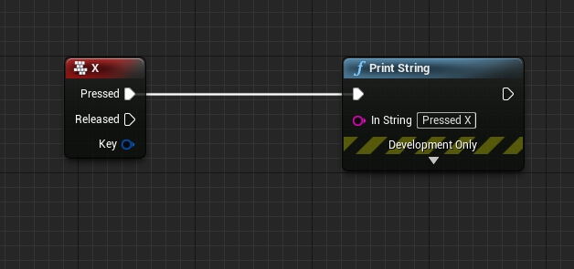
  
   

###

    If we now place an actor into the level, press Play, and then press the "X" key,
    we'll notice that nothing happens. That is because we must first configure the actor
    to actually receive inputs.

    Select the actor, in the Details panel find Input->Auto Receive Input
    and select "Player 0".

###

  

  
click to expand 

  
  
   

###

    Now if we press Play and press "X" we get the print string "Pressed X".

###

  

  
click to expand 

  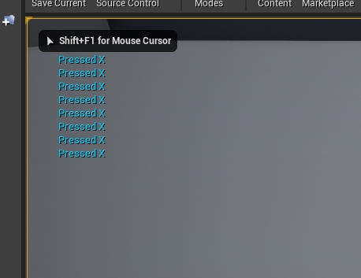
  
   

###

---

### [Variables](https://github.com/Bleeck/UE_Workshop/blob/main/Session_1.md)

    You create variables by clicking on the plus sign in the Variables section
    of the "MyBlueprint" panel.
###

  

  
click to expand 

  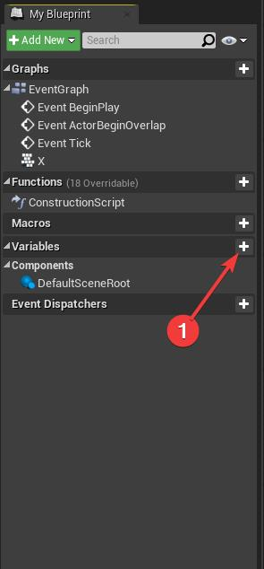
  
   

###

    You define a variable by setting 2 properties. It's name and it's
    type.
    After clicking on the plus icon you can immediately start to type in it's name.
    We'll name this variable "Counter".

    After typing in the name, you LMB click on the icon to the left of the newly
    variable. Select "Integer" from the context menu.

    Note: the color of the icon can also be used to quickly determine the type of
    a variable (green = float, cyan-ish = integer, red = boolean, etc)

###

  

  
click to expand 

  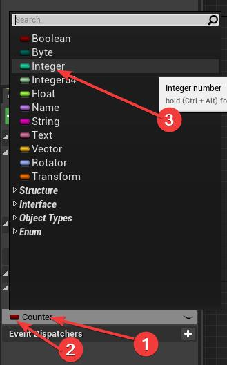
  
   

###

    Note: Optionally you can also set it's default value (if you need it to differ from the
    standard default value of the specified type).

    You do this by selecting the variable and going into the Details panel. That is where
    you can set a different initialization value for this specific variable.

    The default value for integer variables is 0,
    and for our use case we don't need to change it.

###

  

  
click to expand 

  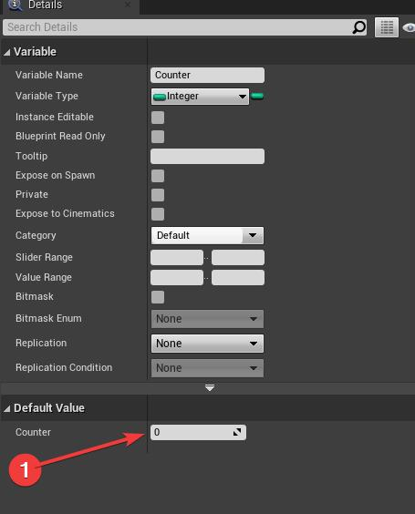
  
   

###

    To use this variable you need to drag and drop it into the event graph.

###

  

  
click to expand 

  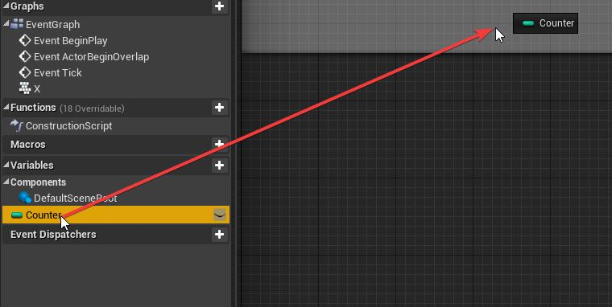
  
   

###

    When you release the click, you will be asked if you either want to "Get" or "Set" the
    variable.

    Getting allows you to read the value of the variable.
    Setting allows you to write a value into the variable.

    We want to read the value so we will select "Get Counter".

###

  

  
click to expand 

  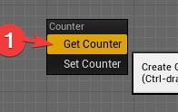
  
   

###

    We can now drag off a line from the new node and we will be presented with a list
    of available actions. This list can be filtered by typing in the name of the
    action we want to perform.

    In our case, we want to add the value of this variable with a number.

    Type in "+".

    This will present us with a few variations. These mostly handle addition between
    different variable types (c++ operator overloads) . We want to add an integer to an
    integer, so we'll select "int + int".

###

  

  
click to expand 

  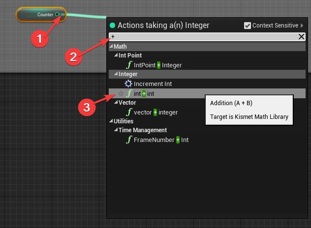
  
   

###

    The + node already has a default value of 1 set into the second  parameter.
    We can, if we'd like, link in variable in the second input, but we just want to
    increase "counter" by one every time we press "X". So we'll leave it as is.
###

  

  
click to expand 

  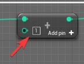
  
   

###

    We've now generated a new value that is equal to "Counter + 1". We now want to store
    this value back into "Counter". To do this we drag a new copy of the "Counter"
    variable into the graph. On release, we select "Set".

    Note: for the simple task of just incrementing a value by 1 there also exists the
     "Increment int" node which increases and also sets the variable.

###

  

  
click to expand 

  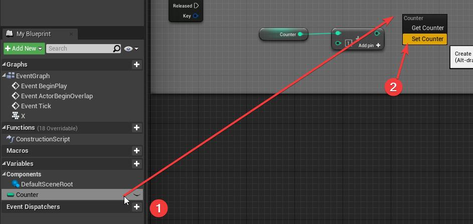
  
   

###

    The "Set" node requires an execution string to pass through it.
    We link it to the "Pressed" execution pin of the "X" keyboard event.

    We also link it with the value pin with the result of our addition.
###

  

  
click to expand 

  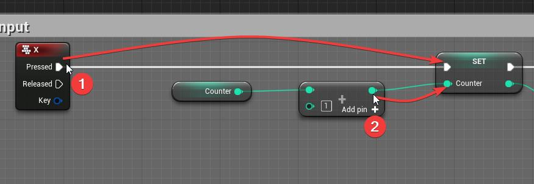
  
   

###

    Lastly, we need to link the execution wire from the "Set" node with the
    input execution pin of the "Print String" node.

    To print the value of the "Counter" variable, we can drag in another "Get" variant
    of the "Counter" variable. Alternatively, we can just link the output of the
    "Set Counter" node with the "In String" pin of "Print String" node.

    We can notice that the "In String" of type string because it's colored pink. You can
    also view the type by hovering the mouse over the input pin. For these base types,
    unreal will usually automatically add conversion nodes.

    By linking in the output of the "Set Counter" node with the "In String" of the
    "Print String" node, unreal automatically adds an "int to string" node between them.

###

  

  
click to expand 

  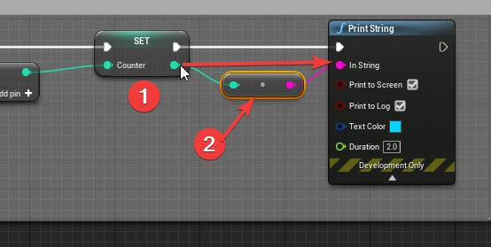
  
   

###
---
### [Debug draw](https://github.com/Bleeck/UE_Workshop/blob/main/Session_1.md)

    Another useful way of debugging our blueprints comes in the form of "Debug Draw".
    This allows us to draw shapes in 3D space. This is extremely useful when trying to
    debug raycasts (collision tests where you check to see if a line intersects geometry).

    To draw a line we use the Draw Debug Line node.
    We set the following parameters:
    - line start : 0 0 0 (the line starts at the origin of the world)
    - line end : 0 0 500 (the line goes straight up for 5 meters)
    - line color : select a red color from the color picker
    - duration : 5 (the line will only be displayed for 5 seconds)
    - thickness : 0 (this doesn't mean that the line won't be visible. If you leave
    this value at 0, unreal will just use the default thickes)

###

  

  
click to expand 

  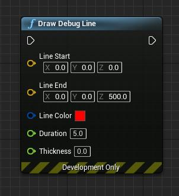
  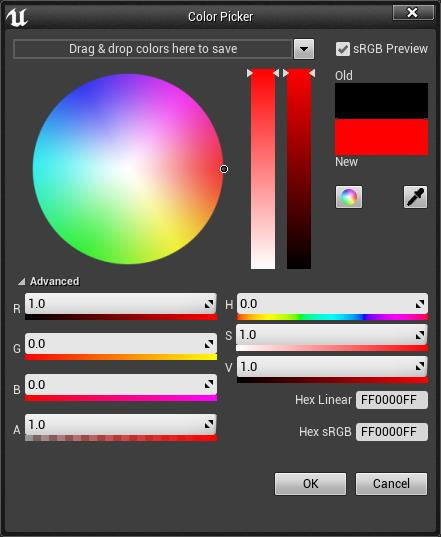
  
   

###

    Connect the "Pressed" execution pin of the "X" keyboard event to the Debug Draw
    Line node.

    Press "Play" and then press "X". In the center of the map you should see a red
    line.

###

  

  
click to expand 

  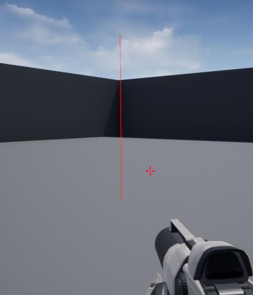
  
   

###

    Setting the draw duration to 0 will render the line for only one frame.
    After that we can connect the node to the "Tick" event. This event fires
    every frame. This means that every frame a line will be drawn that last
    for exactly 1 frame.

###

  

  
click to expand 

  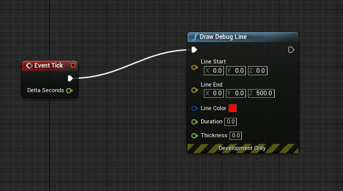
  
   

###

---
### [Flow Control](https://github.com/Bleeck/UE_Workshop/blob/main/Session_1.md)

    The execution of blueprints is controlled by the white execution wires. Nodes execute
    in the order that the wire passes through them.

    The flow of execution can be controlled with certain utility nodes.

    One of the flow control nodes is the Branch node. (if then else)

###

  

  
click to expand 

  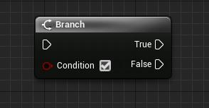
  
   

###

    Depending on the value of the "Condition" input, the execution will continue with
    either the "True" execution pin or the "False" execution pin.

    Add a new variable, call it IsLineGreen and make it of type boolean.

###

  

  
click to expand 

  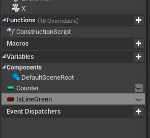
  
   

###

    When we press the "X" key we want to flip the value of the boolean IsLineGreen.
    This means that if IsLineGreen is True then make IsLineGreen false.

###

  

  
click to expand 

  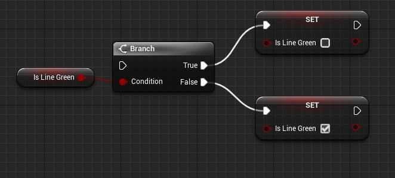
  
  

###

    Note: for boolean values this can be achieved easier by setting
    IsLineGreen = not IsLineGreen (IsLineGreen = !IsLineGreen).

    The "NOT" operator is the negation operator. NOT True is False and NOT False is True.

###

  

  
click to expand 

  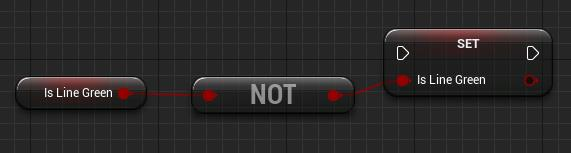
  
  

###    

    After making IsLineGreen negate itself every time "X" is pressed we will
    add a branch node before the "Draw Debug Line".
    By duplicating the "Draw Debug Line" node, we can link the first copy to the
    True execution pin of the Branch node, and the second one to the False execution pin.

    In the "Condition" parameter of the Branch node, we link the "IsLineGreen" variable.

    All that remains is to make sure that the Draw Debug Line connected to the True
    execution pin has it's line color set to green.

###

  

  
click to expand 

  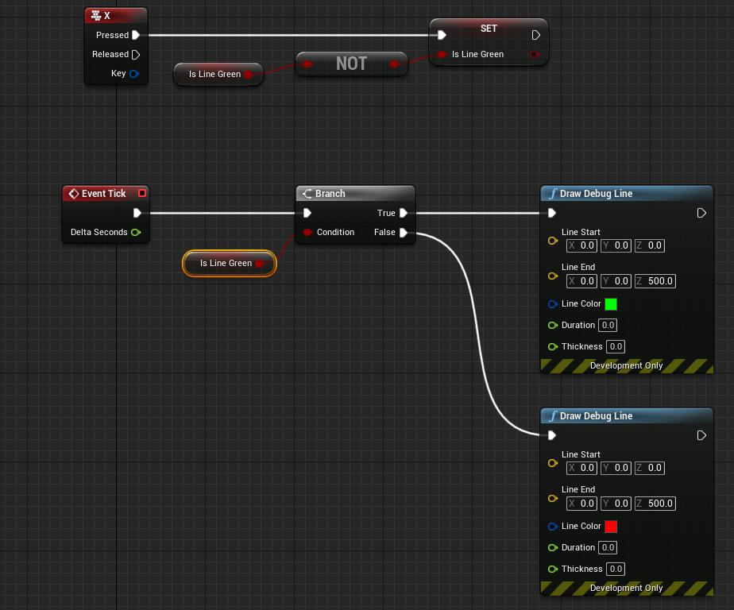
  
  

###    

    If we now start PIE and press "X", we will notice that the line in the center
    of the map switches between red and green color.

###

  

  
click to expand 

  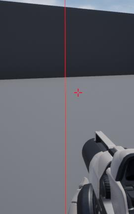
  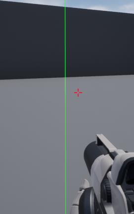
  
  

###    
---
### [Functions](https://github.com/Bleeck/UE_Workshop/blob/main/Session_1.md)

    Functions are a good way to manage complexity.

    You can create a function by clicking on the plus icon in the Functions section
    of the "My Blueprint" panel.

    Name the function "DrawLines"

###

  

  
click to expand 

  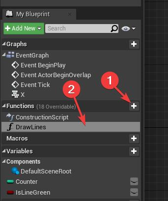
  
  

###    

    The newly created function should also open as a tab and you can navigate to it by
    clicking on the tab.

    Note: double clicking the function in the function list from "MyBlueprint" will also
    open and navigate to this tab.

###

  

  
click to expand 

  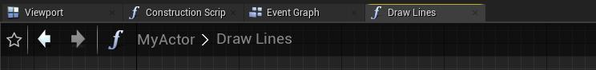
  
  

###    

    We can now move all the nodes, that are currently connected to the "Tick" event,
    inside of the DrawLines function.

###

  

  
click to expand 

  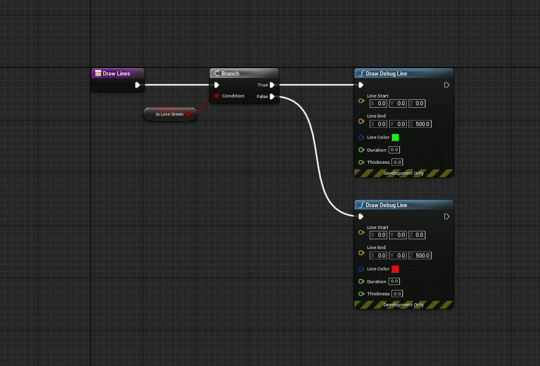
  
  

###    

    The last thing needed is to drag in a copy of the function into the Event Graph and
    link it to the "Tick" node.

###

  

  
click to expand 

  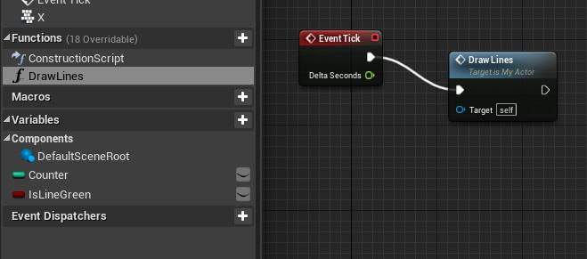
  
  

###    

---
### [Construction Script](https://github.com/Bleeck/UE_Workshop/blob/main/Session_1.md)

    The construction script is a tool for Level Design automation.

    
---
[Back to workshop](https://github.com/Bleeck/UE_Workshop)
