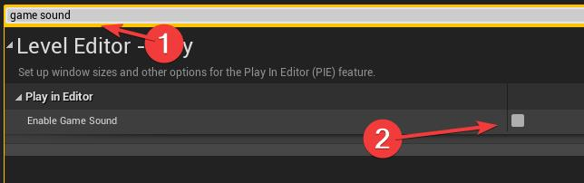
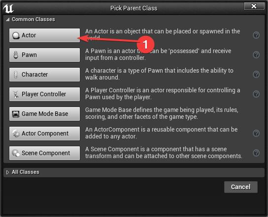
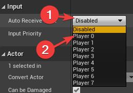

# Session 1
[Back to workshop](https://github.com/Bleeck/UE_Workshop)

---

* [Creating a new project](https://github.com/Bleeck/UE_Workshop/blob/main/Session_1.md#creating-a-new-project)
* [Editor Basics](https://github.com/Bleeck/UE_Workshop/blob/main/Session_1.md#editor-basics)
* [Play In Editor](https://github.com/Bleeck/UE_Workshop/blob/main/Session_1.md#play-in-editor)
* [Editor Settings](https://github.com/Bleeck/UE_Workshop/blob/main/Session_1.md#editor-settings)
* [Blueprint Basics](https://github.com/Bleeck/UE_Workshop/blob/master/Session_1.md#blueprint-basics)
* [Printing to the screen and Detecting inputs](https://github.com/Bleeck/UE_Workshop/blob/master/Session_1.md#printing-to-the-screen-and-detecting-inputs)
---

### [Creating a new project](https://github.com/Bleeck/UE_Workshop/blob/main/Session_1.md)
  - 1:  Launch the "Epic Games Launcher".
  - 2:  Navigate to Unreal Engine->Library
  - 3:  Click on launch on version 4.26.1 (or whatever 4.26.X version you have installed)
  

  
click to expand 

  
  
  

###

    After a few seconds the editor should start and you will be presented with
    the Unreal Project Browser.

    Note: You might be asked to install additional features. Allow
    the editor to install what it needs (like dotnet 3.5 etc).

  - 4:   Select Games. Click Next.
  - 5:   Select First Person. Click Next".
  - 6:   Leave settings to default and set a project location and name. Click Create Project.

  

  
click to expand 

  
  
  
  
  

###

    The Unreal Project Browser allows you to open an existing project or create
    a new one.
    When creating a new project there are two main aspects to consider:
      - the template project to start from
      - blueprint or C++ project

    While you don't need to start from a template project, as you can rebuild
    everything yourself, it's not recommended as the template projects are
    often good starting points (at least for learning purposes).

    Selecting C++ will generate a .sln file that needs to be opened with Visual
    Studio. C++ falls outside the scope of this workshop. We will be sticking
    with Blueprints because they are:
      - easier to understand
      - sufficient for building a complete game (that doesn't heavily deviate
      from the standard systems already implemented in unreal)

  [Where C++ is more or less mandatory](https://forums.unrealengine.com/community/general-discussion/121087-blueprints-vs-c-programming-which-one-to-use?148076-Blueprints-Vs-C-Programming-Which-one-to-use=&viewfull=1#post1013378)

---

### [Editor Basics](https://github.com/Bleeck/UE_Workshop/blob/main/Session_1.md)

click to expand 

   

    * Actor placement browser : this usually doesn't get used that much. Mostly
    used to place lights and volumes
    * ToolBar : Quick access to commonly used commands and menus
    * Content Browser : the asset library of the project
    * World Outliner : lists all of the actors placed in a level
    * Details : shows the properties of the selected level object

---

### [Play In Editor](https://github.com/Bleeck/UE_Workshop/blob/main/Session_1.md)

click to expand 

   

    PIE. By clicking on the play button (or pressing alt + P) the
    editor enters Play in Editor mode. In this mode, the game is running in the
    viewport. To exit PIE press the escape key.

    When PIE starts, LMB clicking in the viewport will lock the mouse cursor to
    that viewport. To release the cursor either press Escape to stop PIE or press
    Shift + F1 to regain control. After regaining control, if you click back
    in the viewport, you will again lose control. In order to select and
    manipulate objects during PIE, click on the Eject Button (or press F8).

WARNING: All changes done in the level during play in     editor are LOST when exiting PIE.

---

### [Editor Settings](https://github.com/Bleeck/UE_Workshop/blob/main/Session_1.md)
  

  
 Open Editor Preferences 

  
  

  

  
 Type in "Search Details" textbox to filter settings 

  
  

  

  
 Disable Autosave 

  
  

      I personally never rely on autosave.

  

  
 Disable Game Sound 

  
  

      If you don't need game sounds, it's easier to just disable them in the
      editor.

  

  
 Disable Use Camera Location From Play In Viewport 

  
  

    This setting will cause the viewport camera to return to where it was before
    the PIE session started. Useful if you're editing a mission and don't want
    to have to keep navigating to the mission start location.

  

  
 Enable Blueprint Save On Successful Compile 

  
  

      This setting will cause the editor to automatically save your blueprint
      when it successfully compiles. I've found that it is extremely rare that
      you don't also click the save button after compiling (and it's usually because
      you forget to save)
  
  

#### Mouse Cursor Icon :
     The default mouse cursor behavior makes the cursor difficult to see in the
     editor viewport. The editor uses the windows "Precision" cursor while the mouse
     is over the viewport. In order to change it perform the following steps:

  

  
 1: Search and open "mouse settings" in start menu 

  
  
   

  

  
 2: Click on "Additional Mouse Options" 

  
  
   

  

  
 3: Go to "Pointers" -> select "Precision Cursor" -> Click on browser 

  
  
   

  

  
 4: Navigate to "C:/Windows/Cursors" and select "aero_arrow.cur". Click on "Open" 

  
  
   

  

  
 5: Click OK to close the window

  
  
   

---

### [Blueprint Basics](https://github.com/Bleeck/UE_Workshop/blob/main/Session_1.md)

    Create a folder by RMB click in the content browser and selecting
    "New Folder". Name it "Work".

  

  
click to expand 

  
  
   

###

    Inside that folder, let's create our first blueprint. Right click in the content browser
    and select Blueprints-> Blueprint Class.

  

  
click to expand 

  
  
   

###

    Select Actor as the parent class. Name the blueprint "MyActor"

  

  
click to expand 

  
  
   

###

    Note: An asterisk next to an asset in the content browser means that
    the asset has unsaved modifications. You can save by RMB clicking on the asset
    and selecting "Save", selecting the asset and pressing CTRL+S or by
    pressing "CTRL + SHIFT + S" which saves everything.

  

  
click to expand 

  
  
   

###

    Double click on the actor to open the blueprint editor.

    The Blueprint Editor contains the following elements:
      - components panel: this is where you can add or remove components on your actor
      - my blueprint: this is where you declare your functions, variables, events etc
      - toolbar: this is were you can find the main debugging controls
      - Details panel

  

  
click to expand 

  
  
   

###

    The Blueprint Editor also has 2 extra panels that are hidden behind the viewport
    panel. Those are:
    - the construction script : useful for level design automation
    - the event graph : the place where you actually do your blueprint
    scripting

  

  
click to expand 

  
  
   

###
---

### [Printing to the screen and Detecting inputs](https://github.com/Bleeck/UE_Workshop/blob/main/Session_1.md)
    To directly get an input (the quick, dirty and incorrect way), we can add a Keyboard Event
    node in the event graph.

    Right click and type "Keyboard Events X" and press enter.

###

  

  
click to expand 

  
  
   

###

    To print something to the screen we need to add a
    "Print String" node.

###

  

  
click to expand 

  
  
   

###

    By connecting the "Pressed" execution pin from the Keyboard Event to the execution pin of
    the "Print String", we will print the string to the screen every time the X key is pressed.

###

  

  
click to expand 

  
  
   

###

    Placing an instance of "MyActor" in the level will not run the input event. That is because
    we must first configure the actor to actually receive inputs.
    Select the actor, in details find Input->Auto Receive Input and select "Player 0".

###

  

  
click to expand 

  
  
   

###

    Now if we press Play and press "X" we get the print string "Pressed X".

###

  

  
click to expand 

  
  
   

###

---

### [Variables](https://github.com/Bleeck/UE_Workshop/blob/main/Session_1.md)

---
[Back to workshop](https://github.com/Bleeck/UE_Workshop)
