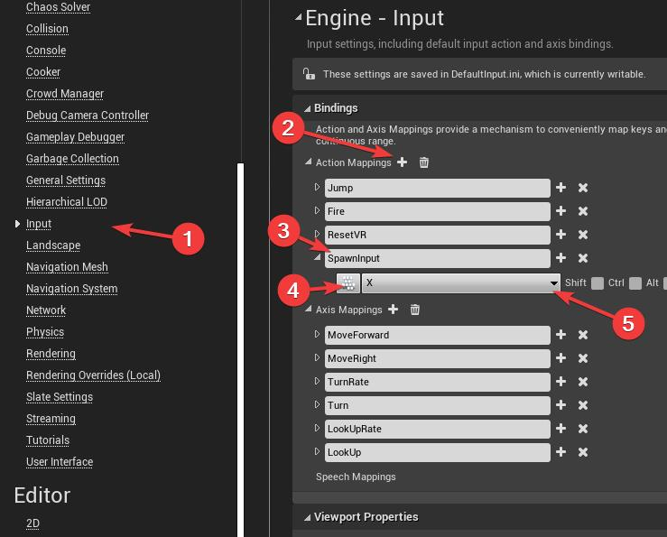
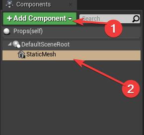
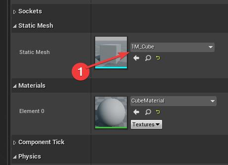
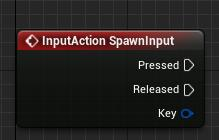
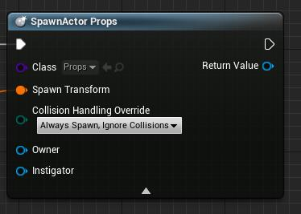

# Session 2
[Back to workshop](https://github.com/Bleeck/UE_Workshop)

---
* [Inputs](https://github.com/Bleeck/UE_Workshop/blob/master/Session_2.md#inputs)
* [Spawning Actors](https://github.com/Bleeck/UE_Workshop/blob/master/Session_2.md#spawning-actors)
* [Switch projectile logic to raycast](https://github.com/Bleeck/UE_Workshop/blob/master/Session_2.md#switch-projectile-logic-to-raycast)
* [Change Hud to fix aiming offset](https://github.com/Bleeck/UE_Workshop/blob/master/Session_2.md#change-hud-to-fix-aiming-offset)
* [Add hit effects](https://github.com/Bleeck/UE_Workshop/blob/master/Session_2.md#add-hit-effects)
* [Blueprint Components](https://github.com/Bleeck/UE_Workshop/blob/master/Session_2.md#blueprint-components)
* [Blueprint Interfaces](https://github.com/Bleeck/UE_Workshop/blob/master/Session_2.md#blueprint-interfaces)

---
### [Inputs](https://github.com/Bleeck/UE_Workshop/blob/main/Session_2.md)

    Inputs need a layer of abstraction in order to accommodate different input devices
    and allow the player to remap them during runtime.

    This layer of abstraction is managed through axis and action mappings.

    Navigate to Project Settings->Input.

    Add an Action Mapping by clicking the plus Icon.

    Name it "SpawnInput".

    You can click on the keyboard icon and press a key in order to record it as
    the input for the SpawnInput action mapping.

  

  
click to expand 

  
  
   

###

    Create a new blueprint (derived from Actor).
    Name it "Props".
    Add a Static Mesh component to the actor and set the mesh to "1M_Cube".

###

  

  
click to expand 

  
  
  
   

###

    In the "MyActor" blueprint we can now replace the "X" keyboard event with an
    Input Action SpawnInput.

###

  

  
click to expand 

  
  
   

###

---

### [Spawning Actors](https://github.com/Bleeck/UE_Workshop/blob/main/Session_2.md)

    You can spawn actors with the "Spawn Actor from Class" node.

    Set the class parameter to the "Props" object previously created.

    Set the "Collision Handling Override" to "Always Spawn, Ignore Collisions"

    Link the Spawn Actor from Class node with the InputAction SpawnInput.

###

  

  
click to expand 

  
  
   

###

    Start a PIE session and press "X". A "Props" actor will spawn in
    the center of the map.
---
### [Switch projectile logic to raycast](https://github.com/Bleeck/UE_Workshop/blob/main/Session_2.md)

    In the FirstPersonCharacter blueprint, change the code that spawns the projectile.
    Replace it with a LineTraceByChannel. The trace start and end position should
    be relative to the camera

---
### [Change Hud to fix aiming offset](https://github.com/Bleeck/UE_Workshop/blob/main/Session_2.md)

    In the FirstPersonHud blueprint, change the Y Size offset from 20 to -5
---
### [Add hit effects](https://github.com/Bleeck/UE_Workshop/blob/main/Session_2.md)

    Use a SpawnEmitterAtLocation node and set the location to the Impact Point the
    Line Trace.
    Use P_Explosion as the emitter template.
---
### [Blueprint Components](https://github.com/Bleeck/UE_Workshop/blob/main/Session_2.md)

    Blueprint Components are reusable blueprint graphs (closer to the Unity approach).

    Create a new blueprint and set the parent to Actor Component.
---
### [Blueprint Interafaces](https://github.com/Bleeck/UE_Workshop/blob/main/Session_2.md)

    Blueprint interfaces are an easy way of transmitting messages between objects.

    Create a new interface and name it "Health Interface".
    Inside it define two functions:
      - Give Damage
      - Kill

    Set the "Props" actor to use the blueprint interface.

---
[Back to workshop](https://github.com/Bleeck/UE_Workshop)
